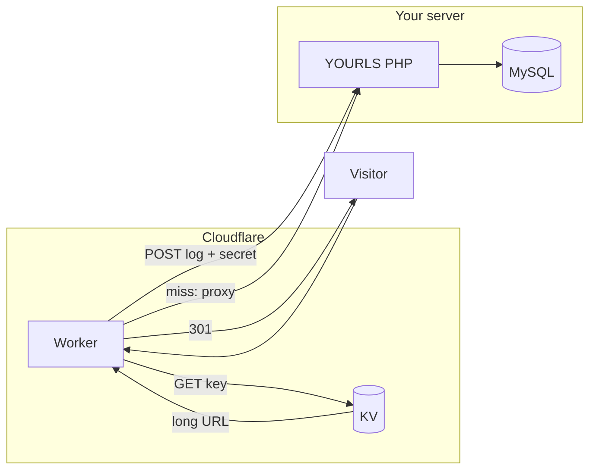

# YOURLS + Cloudflare KV + Worker (edge “cache” for redirects)

This project adds **edge-side storage** for your short links using **Cloudflare Workers KV**, so most redirects are served from Cloudflare’s network without hitting your PHP server on every click. Your YOURLS installation stays the **source of truth** (database); the Worker **falls back** to your origin when a key is missing from KV.

It includes:

| Part | Role |
|------|------|
| **YOURLS plugin** (`user/plugins/cloudflare-kv-sync/`) | On create / edit / delete, writes the keyword to KV via the Cloudflare REST API. |
| **`log-click.php`** (YOURLS root) | Endpoint the Worker calls to record clicks (increments `clicks` and inserts into the log table) using a shared secret header. |
| **Cloudflare Worker** (`worker/`) | KV lookup (`YOURLS_LINKS`) → **301** redirect + `Cache-Control`; optional **click logging** (skips some bot categories); **`keyword+`** passes through for YOURLS stats; on KV miss **`fetch(request)`** to origin; origin **404** → custom HTML page. |

---

## Architecture



**Deploy pattern:** The Worker is usually routed on the **same hostname** as YOURLS (orange-cloud proxy). Pass-through paths use `fetch(request)`, which Cloudflare forwards to your **origin** (PHP). Ensure routes and Page Rules do not create redirect loops; test `/`, `/admin`, and a known short link after deploy.

**Bot Management:** `request.cf.botManagement` (verified bot category) is used to **skip click logging** for some categories. Full category data requires a Cloudflare plan / product that exposes Bot Management on Workers; if unavailable, fields are simply undefined and all clicks are logged as usual.

---

## Prerequisites

- A working [YOURLS](https://yourls.org/) install with `curl` enabled in PHP (for the plugin).
- A Cloudflare account and a zone on Cloudflare.
- [Node.js](https://nodejs.org/) 18+ (for Wrangler CLI to deploy the Worker).

---

## 1. Cloudflare: KV namespace and API token

1. In the Cloudflare dashboard: **Workers & Pages** → **KV** → **Create a namespace** (e.g. `yoursls-links`).
2. Note the **Namespace ID** (used in `CF_KV_NAMESPACE_ID` and `wrangler.toml`).
3. Note your **Account ID** (Workers overview sidebar or URL).
4. Create an **API Token** with permission to write to that namespace, e.g. **Workers KV Storage → Edit** scoped to the account (or use a custom token with `Workers KV Storage:Edit` on the namespace).  
   - Used only on the **server** by the YOURLS plugin (`CF_API_TOKEN`).

---

## 2. YOURLS: config and plugin

1. Copy `user/plugins/cloudflare-kv-sync/` into your YOURLS `user/plugins/` directory.
2. Activate **Cloudflare KV Sync for YOURLS** in the YOURLS admin plugins screen.
3. Append the defines from `config-snippet.php` to `user/config.php` (do **not** commit real secrets to a public repo):

   - `CF_ACCOUNT_ID`
   - `CF_KV_NAMESPACE_ID`
   - `CF_API_TOKEN`
   - `LOGGING_SECRET_KEY` — long random string; must match the Worker secret `LOGGING_SECRET_KEY` (see below).

4. Copy `log-click.php` to the **YOURLS root** (same folder as `yourls-loader.php`).

---

## 3. Cloudflare Worker

1. `cd worker`
2. `npm install`
3. Edit `wrangler.toml` and set `kv_namespaces.id` to your KV namespace ID. The KV **binding name** is `YOURLS_LINKS` (must match the Worker code and can match how you name the namespace in the dashboard).
4. Set the logging secret (same value as `LOGGING_SECRET_KEY` in `user/config.php`):

   ```bash
   npx wrangler secret put LOGGING_SECRET_KEY
   ```

5. Deploy:

   ```bash
   npm run deploy
   ```

6. Attach the Worker to your zone (**Triggers** → **Routes** or a **Custom Domain** on the Worker), typically `example.com/*` or your short domain.

The Worker posts clicks to `https://<request-hostname>/log-click.php` with header `X-Auth-Key: <LOGGING_SECRET_KEY>`, so the hostname that serves the Worker must also resolve `log-click.php` on your origin (usual single-site setup).

### Local development

Copy `worker/.dev.vars.example` to `worker/.dev.vars` and set `LOGGING_SECRET_KEY`. Run `npm run dev`.

---

## 4. Behaviour summary

- **New / updated short URL:** Plugin `PUT`s the long URL as plain text to KV under the keyword.
- **Deleted short URL:** Plugin `DELETE`s that key from KV.
- **Root, `/admin`, `yourls-api.php`, static assets:** Request is passed with `fetch(request)` to the origin (no KV redirect).
- **KV hit:** **301** redirect to the long URL, `Cache-Control: public, max-age=3600`, `X-Robots-Tag: noindex`. Click logging runs in the background unless the request is classified as a denied bot category (when Bot Management data is present).
- **`/keyword+` (stats):** Passes through to origin so YOURLS can show statistics; no edge redirect.
- **KV miss:** `fetch(request)` to origin; if the origin returns **404**, the Worker responds with the **custom HTML** 404 page defined in `worker/src/index.js` (edit `CUSTOM_404_HTML` for your brand).
- **Click logging:** `POST` to `/log-click.php` with `X-Auth-Key` matching `LOGGING_SECRET_KEY`.

---

## 5. Security notes

- Keep `CF_API_TOKEN` and `LOGGING_SECRET_KEY` private. Rotate them if exposed.
- `log-click.php` rejects requests without the correct `X-Auth-Key`.
- Prefer **HTTPS** for your site; the Worker uses `https://` for `log-click.php`.

---

## 6. Backfill existing links

The plugin only syncs on **add / edit / delete**. Existing keywords are not automatically uploaded. Options:

- Re-save links in the admin, or  
- Use the Cloudflare API / a one-off script to `PUT` each `keyword → long URL` from your database.

---

## Repository layout

```
yourls-cloudflare-kv-sync/
├── README.md
├── LICENSE
├── config-snippet.php          # Defines to paste into user/config.php
├── log-click.php               # Copy to YOURLS root
├── user/plugins/cloudflare-kv-sync/
│   └── plugin.php
└── worker/
    ├── package.json
    ├── wrangler.toml
    └── src/index.js
```

---

## Push this project to GitHub

1. Create a **new empty repository** on GitHub (no README/license if you are pushing this existing history): [github.com/new](https://github.com/new). Name it e.g. `yourls-cloudflare-kv-sync`.
2. In a terminal:

   ```bash
   cd path/to/yourls-cloudflare-kv-sync
   git remote add origin https://github.com/YOUR_USERNAME/yourls-cloudflare-kv-sync.git
   git branch -M main
   git push -u origin main
   ```

   If your default branch is `master`, use `git push -u origin master` or rename with `git branch -M main` first.

3. Authenticate with GitHub (browser login, PAT, or SSH) when prompted.

---

## License

MIT — see [LICENSE](LICENSE).
