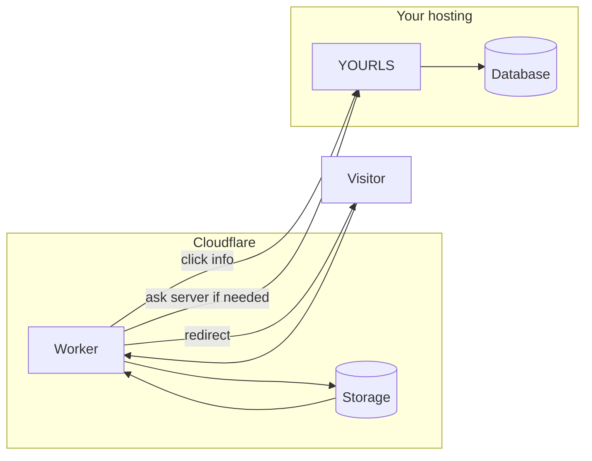

# YOURLS + Cloudflare KV + Worker

Speed up your short links by letting **Cloudflare** remember where each keyword should go. Most visitors get redirected from Cloudflare’s network instead of loading PHP every time. Your **YOURLS database stays in charge**—this only adds a fast copy of the destination URLs on Cloudflare.

## What’s in this project

| Piece | What it does |
|--------|----------------|
| **YOURLS plugin** (`user/plugins/cloudflare-kv-sync/`) | When you add, change, or remove a short link, it updates the copy stored on Cloudflare. |
| **`log-click.php`** (in your YOURLS root folder) | A small script Cloudflare calls so clicks still show up in YOURLS (counts and stats). Protected with a secret key. |
| **Cloudflare Worker** (`worker/`) | Looks up the short keyword, sends the visitor to the long URL, and can log the click. If something isn’t in Cloudflare’s copy yet, it asks your server as usual. |

## How it fits together



Usually the Worker runs on the **same domain** as your YOURLS site (with Cloudflare’s orange cloud on). After you set it up, open your homepage, admin, and a test short link to make sure nothing loops or breaks.

**Optional:** Cloudflare can label some automated traffic (like monitoring bots). The Worker can skip counting those as “clicks” when that information is available on your plan.

## What you need

- [YOURLS](https://yourls.org/) installed and working.
- PHP **curl** enabled (the plugin uses it to talk to Cloudflare).
- A Cloudflare account with your domain on it.
- [Node.js](https://nodejs.org/) 18 or newer (only to install and deploy the Worker).

---

## Step 1 — Cloudflare: storage + API token

1. In Cloudflare: **Workers & Pages** → **KV** → create a **namespace** (any name you like).
2. Copy the **Namespace ID** — you’ll paste it into YOURLS config and into the Worker settings file.
3. Copy your **Account ID** (shown in the Workers area).
4. Create an **API token** that can **edit Workers KV** for that account (or that namespace).  
   This token is **only used on your server** by the YOURLS plugin, not in the Worker.

---

## Step 2 — YOURLS: plugin and config

1. Copy the folder `user/plugins/cloudflare-kv-sync/` into your YOURLS `user/plugins/` folder.
2. In YOURLS admin, **activate** the plugin “Cloudflare KV Sync for YOURLS”.
3. Open `config-snippet.php` in this repo and copy the settings into your `user/config.php`. Fill in your real IDs and token.  
   - Pick a **long random** value for `LOGGING_SECRET_KEY` — you’ll use the **same** value again when you set the Worker secret.  
   - Don’t put real passwords or keys in a **public** Git repo.
4. Copy **`log-click.php`** into your **YOURLS root** (next to `yourls-loader.php`).

---

## Step 3 — Deploy the Worker

1. Open a terminal in the `worker` folder.
2. Run `npm install`.
3. Edit **`worker/wrangler.toml`**: set the KV namespace ID. The name **`YOURLS_LINKS`** must stay as in the file (it links the Worker to that storage).
4. Store the same secret as in YOURLS `LOGGING_SECRET_KEY`:

   ```bash
   npx wrangler secret put LOGGING_SECRET_KEY
   ```

5. Deploy:

   ```bash
   npm run deploy
   ```

6. In Cloudflare, connect this Worker to your domain (**Routes** or **Custom domains**), often something like `yourdomain.com/*`.

The Worker sends click updates to `https://your-domain/log-click.php` — so the domain where short links live should be the same place YOURLS and `log-click.php` are installed (typical single-site setup).

### Try it locally (optional)

Copy `worker/.dev.vars.example` to `worker/.dev.vars`, put your secret in there, then run `npm run dev`.

---

## What happens in practice

- **You create or edit a link:** The plugin updates Cloudflare’s stored copy of the destination URL.
- **You delete a link:** That keyword is removed from Cloudflare’s copy.
- **Someone opens a short URL:** Cloudflare looks up the keyword. If it finds it, the visitor is redirected and (unless skipped for certain bot types) a click is sent to your server for YOURLS to record.
- **Stats page (`keyword+`):** That request goes to your server so YOURLS can show the stats page normally.
- **Homepage, admin, API, images, etc.:** Those requests go to your server; they are not treated as short keywords.
- **Keyword not in Cloudflare yet:** The Worker asks your server instead. If your server returns “not found”, visitors see a **simple generic 404 page** (you can change the HTML in `worker/src/index.js`).

---

## Staying safe

- Treat your API token and `LOGGING_SECRET_KEY` like passwords. Change them if they ever leak.
- `log-click.php` only accepts requests that send the correct secret header.
- Use **HTTPS** on your site.

---

## Old links you added before this plugin

Only **new** changes sync automatically. For links that already existed, either open each one in the admin and save again, or upload them to Cloudflare once using their API or a script (advanced).

---

## Files in this repository

```
yourls-cloudflare-kv-sync/
├── README.md
├── LICENSE
├── config-snippet.php          # Settings to copy into user/config.php
├── log-click.php               # Copy into YOURLS root
├── user/plugins/cloudflare-kv-sync/
│   └── plugin.php
└── worker/
    ├── package.json
    ├── wrangler.toml
    └── src/index.js
```

---

## License

MIT — see [LICENSE](LICENSE).
